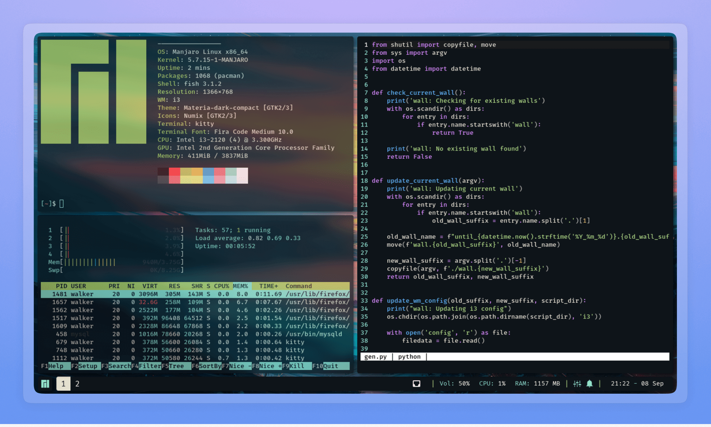

# Apps

### [Localcast](https://github.com/blekmus/localcast)

An application to listen to local podcast archives.

### [Raycast-abridged](https://github.com/blekmus/raycast-abridged)

Index local anime files in Raycast.

### [Raycast-emoticons](https://github.com/blekmus/raycast-emoticons)

Easy access to emoticons in Raycast.

### [Rice](https://github.com/blekmus/rice)

Linux desktop customizations.

