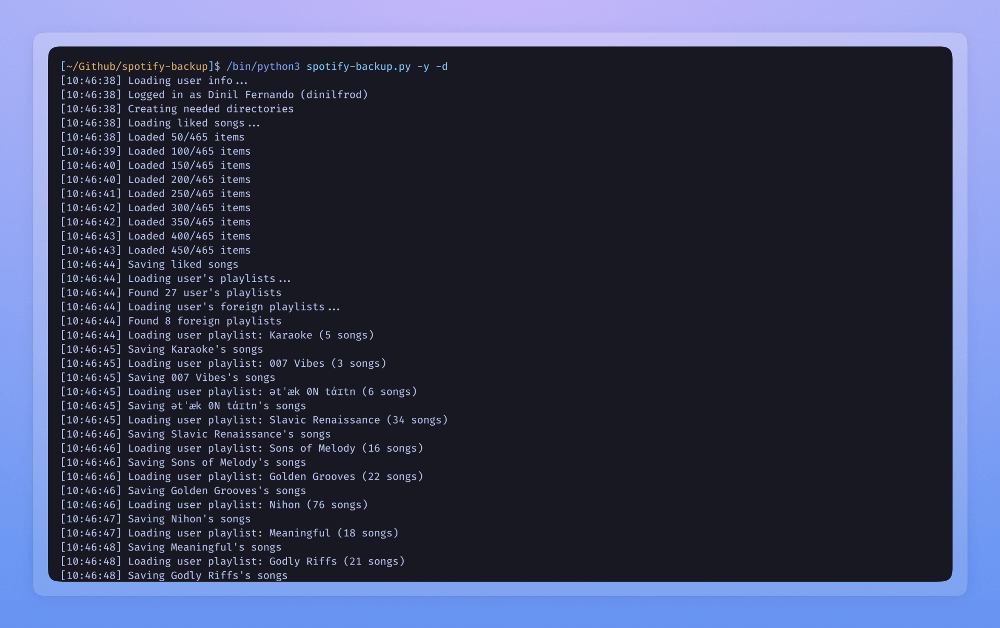

# CLI

### [Abridged-cli](https://github.com/blekmus/abridged-cli)

Index local anime files in a terminal user interface.

### [Spotify-backup](https://github.com/blekmus/spotify-backup)

A backup solution for Spotify liked songs and playlists.

### [Birthday Calendar](https://github.com/blekmus/aws-stable-diffusion)

Sync contact birthdays with Google Calendar.

