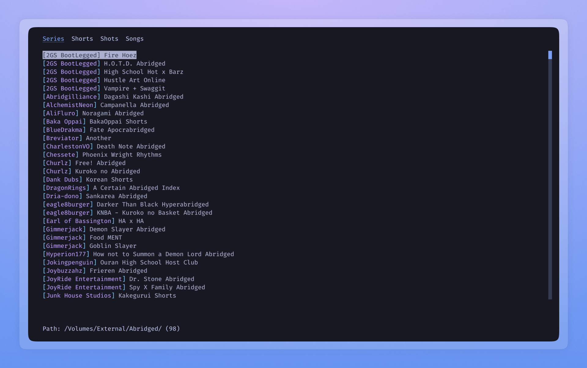
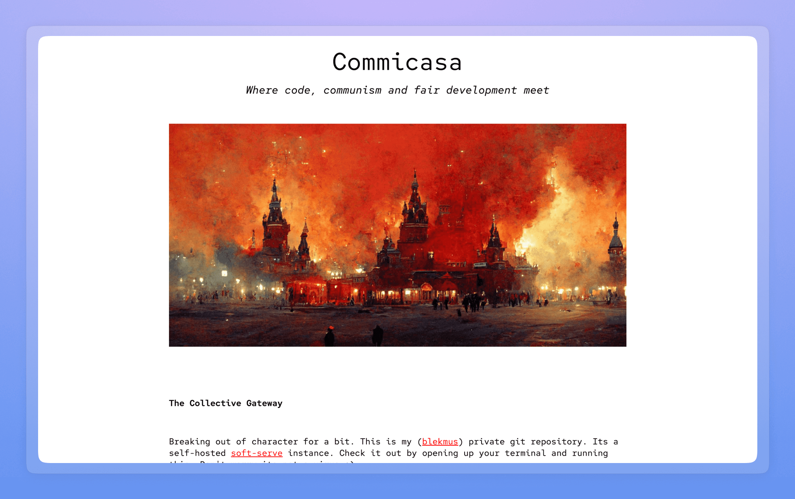
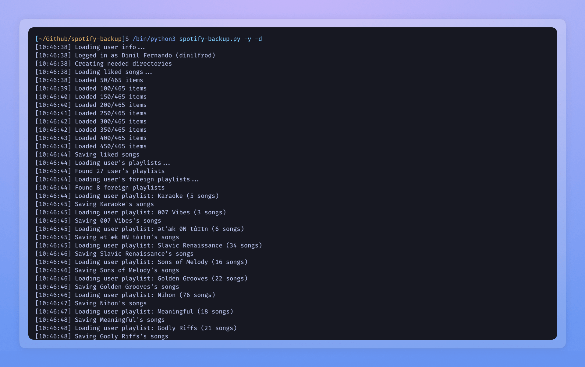
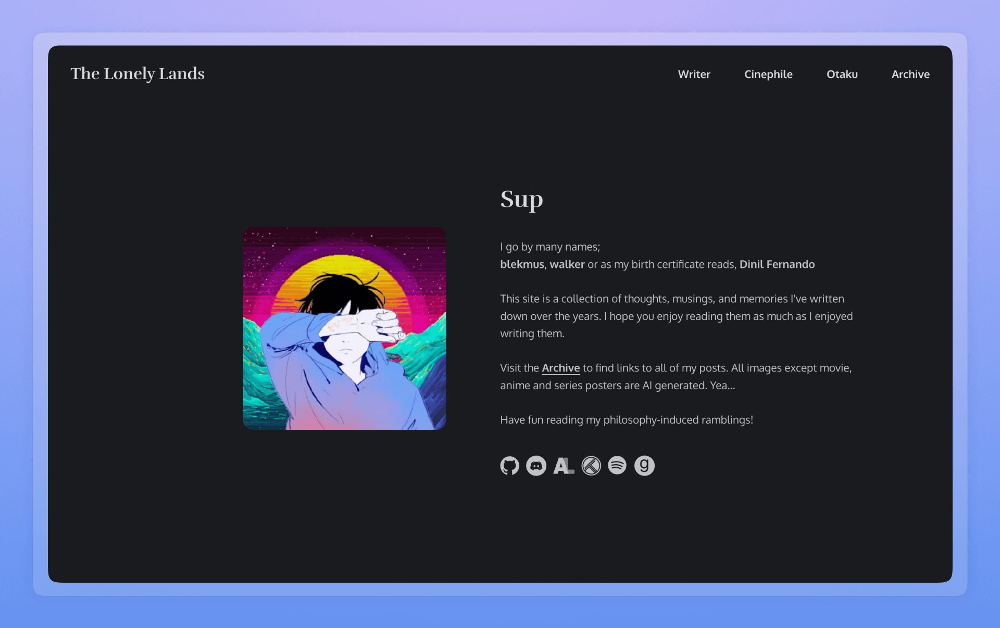
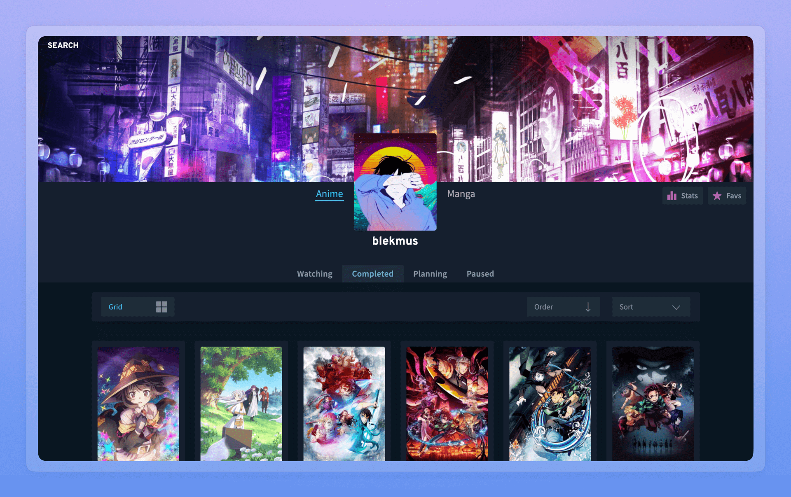
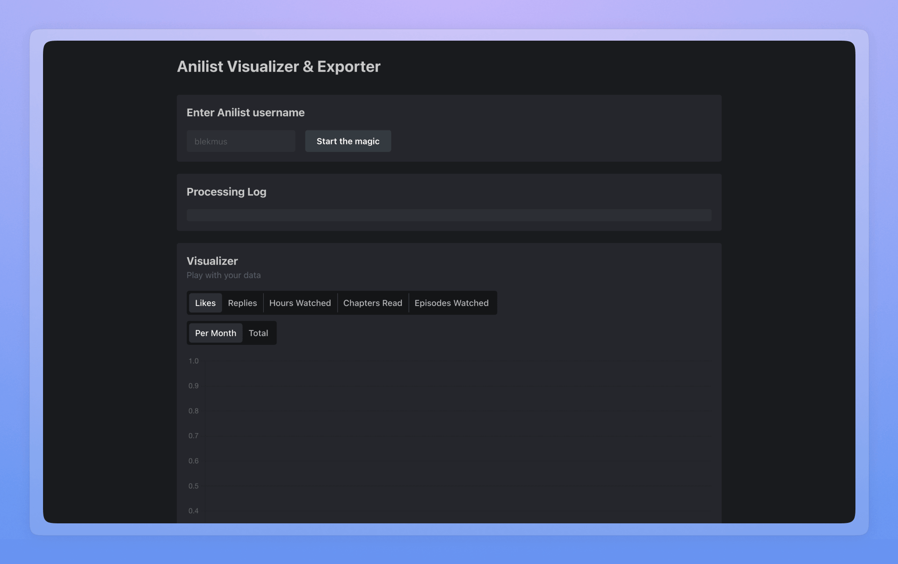

import { Card, Cards } from "@components/card";

# Projects

<Cards>
  <Card
    title="Web"
    href="/projects/web"
    icon={
      <svg
        xmlns="http://www.w3.org/2000/svg"
        version="1.1"
        viewBox="-5.0 -10.0 110.0 135.0"
        fill="currentColor"
      >
        <path d="m79.859 79.781c7.625-7.6406 12.328-18.172 12.328-29.781s-4.7969-22.312-12.531-29.969h-0.015625c-7.625-7.5312-18.094-12.203-29.641-12.203s-22.016 4.6719-29.641 12.203l-0.015625 0.015625c-7.7344 7.6562-12.531 18.25-12.531 29.969s4.7969 22.312 12.531 29.969c7.625 7.5469 18.094 12.203 29.641 12.203s22.094-4.7031 29.719-12.281c0.046875-0.046875 0.09375-0.078125 0.125-0.125zm-9.125-6.25c2.5312-6.3281 4.0625-13.859 4.2344-21.969h14.047c-0.39062 9.75-4.3594 18.594-10.641 25.234-2.3594-1.2656-4.9062-2.3594-7.6406-3.2656zm-49.109 3.2656c-6.2812-6.6406-10.266-15.484-10.641-25.234h14.047c0.17188 8.1094 1.7031 15.656 4.2344 21.969-2.7188 0.90625-5.2812 2-7.6406 3.2656zm0-53.594c2.3594 1.2656 4.9062 2.3594 7.6406 3.2656-2.5312 6.3281-4.0625 13.859-4.2344 21.969h-14.047c0.39062-9.75 4.3594-18.594 10.641-25.234zm56.75 0c6.2812 6.6406 10.266 15.484 10.641 25.234h-14.047c-0.17188-8.1094-1.7031-15.656-4.2344-21.969 2.7188-0.90625 5.2812-2 7.6406-3.2656zm-6.5156 25.234h-20.297v-18.797c5.7031-0.125 11.203-0.90625 16.25-2.2969 2.4062 6 3.875 13.25 4.0469 21.078zm-20.297-21.922v-15.469c5.9688 0.75 11.281 5.7969 14.969 13.422-4.6562 1.2344-9.7188 1.9375-14.969 2.0469zm-3.125-15.469v15.469c-5.25-0.10938-10.312-0.8125-14.969-2.0469 3.6875-7.6094 9-12.656 14.969-13.422zm0 18.594v18.797h-20.297c0.17188-7.8438 1.6406-15.094 4.0469-21.078 5.0469 1.3906 10.547 2.1719 16.25 2.2969zm-20.297 21.922h20.297v18.797c-5.7031 0.125-11.203 0.90625-16.25 2.2969-2.4062-6-3.875-13.25-4.0469-21.078zm20.297 21.922v15.469c-5.9688-0.75-11.281-5.7969-14.969-13.422 4.6562-1.2344 9.7188-1.9375 14.969-2.0469zm3.125 15.469v-15.469c5.25 0.10938 10.312 0.8125 14.969 2.0469-3.6875 7.6094-9 12.656-14.969 13.422zm0-18.594v-18.797h20.297c-0.17188 7.8438-1.6406 15.094-4.0469 21.078-5.0469-1.3906-10.547-2.1719-16.25-2.2969zm24.469-49.453c-2.0312 1.0312-4.2188 1.9375-6.5469 2.7031-2.125-4.4531-4.7656-8.1719-7.7812-10.875 5.375 1.6875 10.234 4.5156 14.328 8.1719zm-45.516 2.6875c-2.3281-0.76562-4.5156-1.6562-6.5469-2.7031 4.0938-3.6719 8.9688-6.4844 14.328-8.1719-3.0156 2.7031-5.6562 6.4219-7.7812 10.875zm-6.5469 55.5c2.0312-1.0312 4.2188-1.9375 6.5469-2.7031 2.125 4.4531 4.7656 8.1719 7.7812 10.875-5.375-1.6875-10.234-4.5156-14.328-8.1719zm45.516-2.6875c2.3281 0.76562 4.5156 1.6562 6.5469 2.7031-4.0938 3.6719-8.9688 6.4844-14.328 8.1719 3.0156-2.7031 5.6562-6.4219 7.7812-10.875z" />
      </svg>
    }
  />
  <Card
    title="CLI"
    href="/projects/cli"
    icon={
      <svg
        viewBox="0 0 256 256"
        xmlns="http://www.w3.org/2000/svg"
        stroke="currentColor"
      >
        <polyline
          fill="none"
          points="80 96 120 128 80 160"
          stroke-linecap="round"
          stroke-linejoin="round"
          stroke-width="16"
        />
        <line
          stroke-linecap="round"
          stroke-linejoin="round"
          stroke-width="16"
          x1="136"
          x2="176"
          y1="160"
          y2="160"
        />
        <rect
          fill="none"
          height="160"
          rx="8.5"
          stroke-linecap="round"
          stroke-linejoin="round"
          stroke-width="16.97"
          width="192"
          x="32"
          y="48"
        />
      </svg>
    }
  />
  <Card
    title="Apps"
    href="/projects/apps"
    icon={
      <svg
        xmlns="http://www.w3.org/2000/svg"
        viewBox="0 0 24 30"
        x="0px"
        y="0px"
        fill="currentColor"
      >
        <path d="M11.32,4.5c0-1.516-1.233-2.75-2.75-2.75H4.5c-1.517,0-2.75,1.234-2.75,2.75v4.07c0,1.516,1.233,2.75,2.75,2.75h4.07c1.517,0,2.75-1.234,2.75-2.75V4.5Zm-1.5,4.07c0,.689-.561,1.25-1.25,1.25H4.5c-.689,0-1.25-.561-1.25-1.25V4.5c0-.689,.561-1.25,1.25-1.25h4.07c.689,0,1.25,.561,1.25,1.25v4.07Z" />
        <path d="M8.57,12.68H4.5c-1.517,0-2.75,1.234-2.75,2.75v4.07c0,1.516,1.233,2.75,2.75,2.75h4.07c1.517,0,2.75-1.234,2.75-2.75v-4.07c0-1.516-1.233-2.75-2.75-2.75Zm1.25,6.82c0,.689-.561,1.25-1.25,1.25H4.5c-.689,0-1.25-.561-1.25-1.25v-4.07c0-.689,.561-1.25,1.25-1.25h4.07c.689,0,1.25,.561,1.25,1.25v4.07Z" />
        <path d="M22.25,4.5c0-1.516-1.233-2.75-2.75-2.75h-4.07c-1.517,0-2.75,1.234-2.75,2.75v4.07c0,1.516,1.233,2.75,2.75,2.75h4.07c1.517,0,2.75-1.234,2.75-2.75V4.5Zm-1.5,4.07c0,.689-.561,1.25-1.25,1.25h-4.07c-.689,0-1.25-.561-1.25-1.25V4.5c0-.689,.561-1.25,1.25-1.25h4.07c.689,0,1.25,.561,1.25,1.25v4.07Z" />
        <path d="M17.465,12.68c-2.639,0-4.785,2.146-4.785,4.785s2.146,4.785,4.785,4.785,4.785-2.146,4.785-4.785-2.146-4.785-4.785-4.785Zm0,8.07c-1.812,0-3.285-1.474-3.285-3.285s1.474-3.285,3.285-3.285,3.285,1.474,3.285,3.285-1.474,3.285-3.285,3.285Z" />
      </svg>
    }
  />
</Cards>

### [Abridged-cli](https://github.com/blekmus/abridged-cli)

Index local anime files in a terminal user interface.

### [Commicasa](https://git.dinil.dev/)

Self hosted git host for personal code.

### [Localcast](https://github.com/blekmus/localcast)

An application to listen to local podcast archives.

### [Spotify-backup](https://github.com/blekmus/spotify-backup)

A backup solution for Spotify liked songs and playlists.

### [The Lonely Lands](https://github.com/blekmus/next-thelonelylands)

A collection of thoughts, musings, and memories written down over the years by me.

### [Raycast-abridged](https://github.com/blekmus/raycast-abridged)

Index local anime files in Raycast.

### [Raycast-emoticons](https://github.com/blekmus/raycast-emoticons)

Easy access to emoticons in Raycast.

### [Rice](https://github.com/blekmus/rice)

Linux desktop customizations.

### [AniTracker](https://github.com/blekmus/anime-tracker-react)

A reimagined front-end for Anilist.

### [AniStats](https://github.com/blekmus/next-anistats)

Calculate real time Anilist stats.

{/* TODO */}
{/* add vapor stage */}
{/* add php final project */}
{/* add portfolio */}