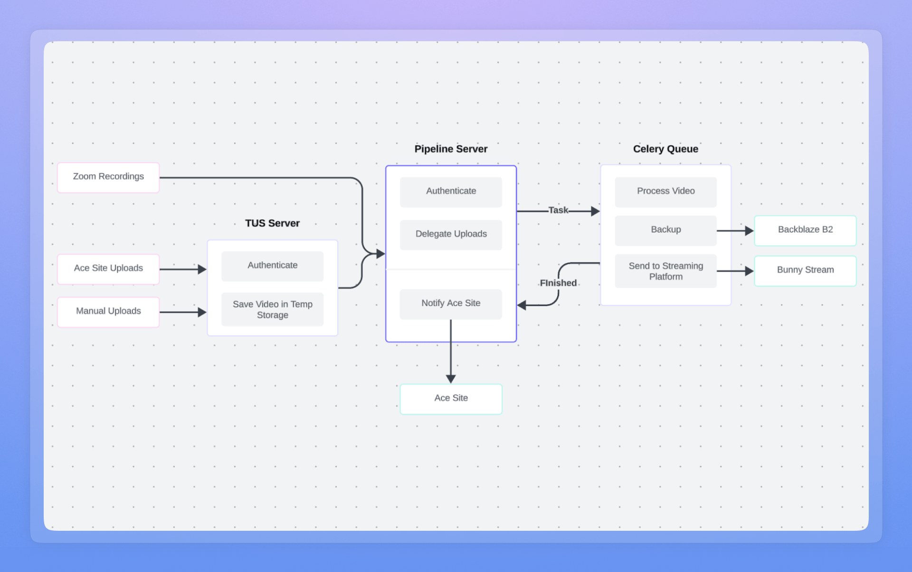
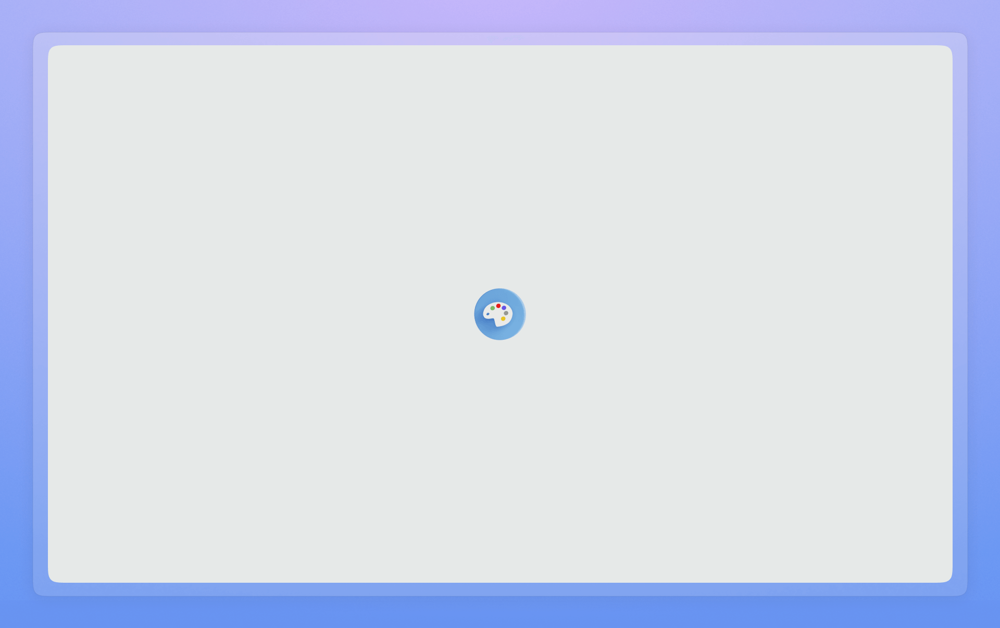
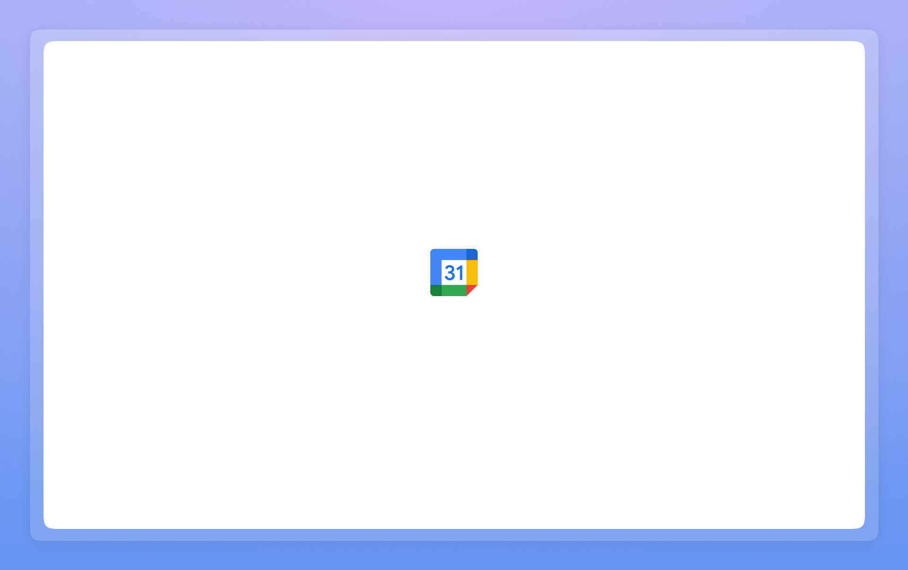

# Services

### [Spotify-backup](https://github.com/blekmus/spotify-backup)

A backup solution for Spotify liked songs and playlists.

### [Recording Pipeline](https://github.com/blekmus/ace-recording-pipeline)

Automated recording pipeline for Ace Academy.

### [AWS Stable Diffusion](https://github.com/blekmus/aws-stable-diffusion)

A guide to setting up SD Automatic1111 WebUI on AWS.

### [Birthday Calendar](https://github.com/blekmus/aws-stable-diffusion)

Sync contact birthdays with Google Calendar.

### [Rice](https://github.com/blekmus/rice)

Linux desktop customizations.

