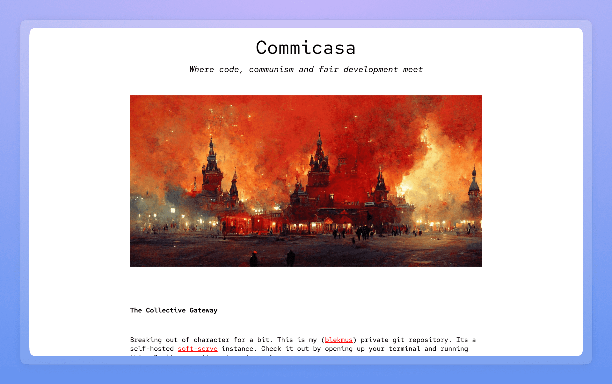
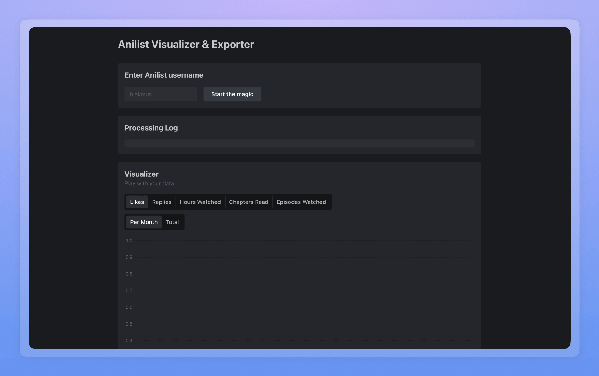

# Web

### [Ace Academy](https://aceacademy.lk)

Online learning platform for students in Sri Lanka.

### [Commicasa](https://git.dinil.dev/)

Self hosted git host for personal code.

### [The Lonely Lands](https://github.com/blekmus/next-thelonelylands)

A collection of thoughts, musings, and memories written down over the years by me.

### [AniTracker](https://github.com/blekmus/anime-tracker-react)

A reimagined front-end for Anilist.

### [AniStats](https://github.com/blekmus/next-anistats)

Calculate real time Anilist stats.

### [Embrace](https://embrace.aceacademy.lk)

Site featuring a webinar series made for Ace Academy.

### [Vapor Stage](https://github.com/blekmus/vaporstage)

Redesign of Style Stage with a minimal vaporwave aesthetic.

### [Paperdia](https://aceacademy.lk/papers)

Student run examination past paper library.

### [AniNotes](https://github.com/blekmus/slim-aninotes)

View and edit Anilist notes in one place.

